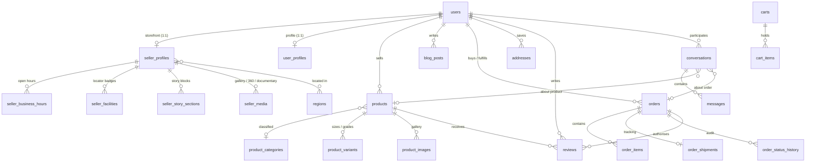

# Database Schema — Lokapren

MVP design for the Indonesian city-focused UMKM marketplace described in `AGENTS.md`.
Every table below is derived from a screen in `scratchpad/*.pdf`; the source screen is
noted in each section. Tables that only served non-MVP extras were deliberately left out —
see §11.

Stack: CodeIgniter 4 + CodeIgniter Shield + **MariaDB** (app) and **SQLite3** (`tests`
group, `db_` prefix). All migrations are verified to run on both engines.

Result: **26 marketplace tables** + 7 Shield tables + `settings`, 57 foreign keys,
94 non-primary indexes.

---

## 1. Core decisions

| # | Decision | Rationale |
|---|----------|-----------|
| 1 | **No `stores` table.** `seller_profiles.user_id` is `UNIQUE` and FK → `users.id`. | AGENTS invariant 5/6: a storefront *is* a seller. One row per seller, not a second entity. |
| 2 | **Money is `BIGINT` integer rupiah.** Never `DECIMAL`, never `FLOAT`. | AGENTS: "Do not use floating-point arithmetic for money." Every amount column is server-computed and snapshotted onto the order. |
| 3 | **Statuses are `VARCHAR`, not `ENUM`.** Allowed values documented per column. | CI4 Forge has no `ENUM` support and `ENUM` is not portable to the SQLite3 test engine. Values are validated in application code and in `Config/Validation.php`. |
| 4 | **Ownership is always FK → `users.id`.** No `seller_id` can be client-supplied. | AGENTS: "Never trust client-supplied `user_id`, `seller_id`…". Controllers resolve the id from Shield, never from the request. |
| 5 | **Auth is `users.username` + `auth_identities` email + `users.password`. No phone number anywhere in the schema.** | Shield already stores the email in `auth_identities`, not `users`, so no schema change is needed at all. `Auth::$validFields = ['email', 'username']` accepts either identifier. |
| 6 | **Seller location lives inside `seller_profiles`.** | AGENTS: "Seller location belongs to the seller/profile domain." Every screen shows exactly one workshop per seller, so a flat 1:1 keeps the invariant structurally true. |
| 7 | **Orders snapshot everything mutable.** `order_items` stores name/variant/sku/image/unit_price; `orders` stores the whole address block. | A historical invoice must not change when a product or address is later edited. |
| 8 | **Aggregates are denormalized but server-only.** `rating_average`, `rating_count`, `sold_count`, `visit_count`, `artisan_count` are recomputed by the application. | Storefront and catalog need read-speed. Never read these from the request. |
| 9 | **`regions` is the single reference for Indonesian geography** (province → regency → district → village). | "Indonesian city-focused". Used by the locator, address forms, search-by-city and buyer geography. |
| 10 | **Deletes cascade only for true child rows.** `products` is `RESTRICT` from `order_items` so sold history cannot vanish. | Auditability of orders, reviews and payouts. |
| 11 | **`identity_number` (NIK) is optional and must be encrypted at rest**; never render it. | Profile PDF asks for "Nama Lengkap Sesuai KTP". Flagged in §10. |
| 12 | **Chat bodies are stored as plaintext `TEXT`, not encrypted.** | The design *claims* an internal encryption channel; storing ciphertext would break search, moderation and reporting. Revoke/retention is handled in application code. Flagged in §10. |
| 13 | **`addresses.recipient_phone` and `orders.ship_recipient_phone` are delivery data, not login identifiers.** | AGENTS: "Use Indonesian conventions for … phone numbers". A courier needs a number; no authentication path uses it. |

---

## 2. Entity relationship overview

---

## 3. Identity, regions and the storefront

**Source:** `Autentikasi & Masuk Akun`, `Virtual Storefront & Profil Artisan`,
`Lokator Galeri & Peta Pengrajin Magelang`

| Table | Purpose | Design evidence |
|---|---|---|
| `users` *(Shield only, unmodified)* | `id`, `username`, `password`, `status`, `active`, `last_active`, soft-delete columns. Email lives in `auth_identities`. | "Email" + username registration. **No phone column** — see decision 5. |
| `regions` | province → regency → district → village hierarchy, with `code` (Kemendagri) and centroid lat/lng. | "Kec. Borobudur, Kab. Magelang, Jawa Tengah 56553"; locator filters by desa. |
| `seller_profiles` | **The storefront.** Identity, presentation, location, trust and aggregate stats. `user_id` UNIQUE. | "SENTRA BUDAYA CANDIREJO", `partner_code` = `#BDR-88219`, tagline, "4.9 / 5.0", "428 Ulasan Terkurasi", `avg_response_minutes` = "12m", `artisan_count` = "14 Pengukir", `is_verified` = "Verified Magelang Artisan", full address block + `latitude`/`longitude`/`landmark_distance_km` = "3.2 km dari Candi Borobudur". |
| `seller_business_hours` | One row per weekday (`day_of_week` UNIQUE with seller). | "Buka • 08.00 - 17.00 WIB", "Buka Sekarang". |
| `seller_facilities` | Locator filter chips. | "Kelas Memahat", "Parkir Bus Wisata", "Praktik Pengerjaan Liat", "Galeri Virtual 360°". |
| `seller_story_sections` | "Filosofi & Sejarah Kriya Candirejo" blocks. | "Akar Ilosfi Budaya", "Material Berkelanjutan SVLK", "Dampak Nyata Komunitas". |
| `seller_media` | Storefront gallery, 360° tours and documentary video with duration. | "DOKUMENTER PERAJIN MANDIRI", "Tonton Proses Kriya (3:45 min)". |

---

## 4. Catalog

**Source:** `Smart Catalog & Detail Produk Kriya`, `Virtual Storefront`

| Table | Purpose | Design evidence |
|---|---|---|
| `product_categories` | Self-referencing tree with `position`, drives the catalog tab counts. | "Semua Produk (48) · Ukiran Kayu Jati (14) · Batik Tulis (12) · Anyaman Bambu (8) · Gerabah (9)". |
| `products` | The listing. Price, stock, material/finishing, `story` narrative, MTO flag, ratings/orders/sold counters. | `#LKP-MGL-4491`, "Rp 450.000", "18 RAGAM PAIS AU TATA H" (stock), "Jati Perhutani (Grade A)", "Non-toxic Linseed Oil", "KISAH FILOSOFIS & NILAI SPIRITUAL". |
| `product_variants` | Priced size/grade combinations with their own SKU and stock. `label` carries the human text. | "Ukuran M 25x20 Rp340.000 / Ukuran L 35x28 Rp450.000 TERLARIS / Kolektor XL 50x40 Rp820.000". |
| `product_images` | Product gallery, optionally scoped to a variant, with `caption` and `is_primary`. | "TAMPAK DEPAN / DETAIL PAHAT / INTERIOR STAGING / BESEK BAMBU". |

A variant is selected by `product_variants.label` (e.g. `Ukuran L (35x28 cm)`); there is no
separate option-group/option-value/pivot layer in the MVP. `products.material` and
`products.finishing` carry the spec block that `product_specs` previously duplicated.

---

## 5. Profiles, addresses and content

**Source:** `Profil Pengguna & Penikmat Kriya`, seller blogs

| Table | Purpose | Design evidence |
|---|---|---|
| `user_profiles` | 1:1 with `users`. KTP name, nickname, birth date, identity status, partner tier, impact counters. `identity_number` is optional PII. | "Budi Santoso Wibowo" / "Mas Budi", "06/1988", "Akun Budaya Terverifikasi", "Tingkat Abipraya", "6 Sanggar / 12 Karya / 4.8M Kontribusi". |
| `addresses` | Address book incl. hotel/villa/homestay + courier instructions, with a recipient phone for delivery. | "Alamat Antar Utama (Integrasi Penginapan)", "Hotel / Villa Liburan", "Titik Kury: Mohon serahkan ke Resepsionis…". |
| `blog_categories` | Blog taxonomy. | Seller blogs feature. |
| `blog_posts` | Seller blog posts (`seller_id` = owner, enforced server-side). | "Seller blogs" in AGENTS. |

---

## 6. Chat

**Source:** `Native In-App Chat & Pesan Pengrajin Lokapren`

| Table | Purpose | Design evidence |
|---|---|---|
| `conversations` | Customer ↔ seller thread, scoped to an optional product and optional order. **UNIQUE `(customer_id, seller_id, product_id)`.** | "Order #LK-88219 (Plakat Relief)", "Belum Dibaca 2", per-side unread counters and archive flags. |
| `messages` | Text/image/audio/product-card/order-card messages with read receipts and attachment metadata. | "Penjelasan Serat Kayu (0:38)", "KRIYA TERPILIH" product card, "Terkirim" vs "Sudah dibaca". |
| `seller_quick_replies` | Seller-defined suggested prompts. | "Bisa custom nama?", "Min. berapa Pemesanannya?", "Estimasi tiba Pesan Antar Terima?". |

Participant access is the app's job: load a conversation only when the authenticated
Shield user is `customer_id` or `seller_id`.

> Note: `UNIQUE (customer_id, seller_id, product_id)` does not collapse rows where
> `product_id IS NULL` on MariaDB or SQLite. If a single general customer↔seller thread is
> required, enforce it in the query builder (`find all threads → reuse the newest`).

---

## 7. Cart and orders

**Source:** `Checkout & Pengiriman Pesan Antar Terima`, `Dashboard Analitik`

| Table | Purpose | Design evidence |
|---|---|---|
| `carts` / `cart_items` | Persistent per-user cart, pre-grouped by `seller_id`. | "TINJAUAN KERANJANG", items grouped per sanggar, "Pesan Khusus Grafir / Catatan Perajin". |
| `orders` | **One order per seller.** Full money breakdown + address snapshot + courier choice + chosen payment method. | `#LKP-77291`, `subtotal` → `shipping_total` → `service_total` → `tax_total` → `grand_total`, "QRIS Realtime", "VA Mandiri", "GoPay". |
| `order_items` | Line items with full snapshot of name, variant label, SKU, image, unit price. | "1 × Rp 450.000", "2 Paket • Gift Box Besek". |
| `order_shipments` | Courier lifecycle, tracking number. | "Nomor resi LKP", "Ekspedisi Kargo Kayu + Proteksi Asuransi". |
| `order_status_history` | Append-only transition audit with actor. | Server-side transition validation, dashboard filters "Perlu Dikirim (8) / Dalam Pengiriman (12) / Selesai (14)". |

There is no `payments` table in the MVP: no gateway is integrated, so payment state is
`orders.status` + `orders.payment_method` + `orders.paid_at`. Add a `payments` table when a
real QRIS/VA/ewallet integration lands. The receipt breakdown lives in the `orders.*_total`
columns rather than a separate `order_charges` table.

### Order status machine

`pending_payment → awaiting_artisan → in_production → ready_to_ship → shipped → delivered → completed`
with `cancelled` and `refunded` as terminal branches.

`orders.production_progress` backs "Proses 85%" on the customer profile.
Allowed transitions are enforced server-side; `orders.status` is never read from the request.

---

## 8. Reviews, ratings and seller analytics

**Source:** `Smart Catalog` (review block), `Dashboard Analitik & Bisnis Mitra UMKM`

| Table | Purpose | Design evidence |
|---|---|---|
| `reviews` | **UNIQUE `(order_id, product_id)` and UNIQUE `order_item_id`** — one review per purchased line item, so purchase is provable and double-reviewing is impossible. | "4.9 · Dari 142 Ulasan Terverifikasi", "Pembeli Terverifikasi • Jakarta Selatan", star breakdown 94%/6%/0%… |
| `review_images` | Review photos. | "Foto Ulasan: Meja Kantor Modern SCBD". |
| `seller_daily_stats` | Daily rollup keyed `(seller_id, stat_date)`. | Omzet, Pengunjung, Pesanan, "Sabtu (Puncak Liburan)", "Unduh Laporan Toko". |

Purchase is guaranteed by the `order_items` FK rather than by a denormalized
`is_verified_purchase` flag. The raw `seller_visits` hit log and the `seller_ledger_entries`
cash book were removed: revenue is derived from `orders.seller_earning` grouped by day, and
`visit_count` on the rollup is incremented on storefront view.

Buyer geography on the dashboard is derived by `GROUP BY orders.ship_regency_id` — no
extra table needed, because every order snapshots the destination region.

---

## 9. How the schema supports the security invariants

| Invariant | Schema-level support | Remaining app work |
|---|---|---|
| Only `customer` / `seller` roles | `Config/AuthGroups` already declares exactly those two. | — |
| No admin, no store entity | No `stores`/`admins` table exists; `seller_profiles.user_id` is UNIQUE. | — |
| Seller A cannot touch Seller B's data | Every seller-owned table keys on `seller_id`/`user_id`; no table grants a seller access to another. | Scope every query with `seller_id = currentUser.id`. |
| Customer A cannot read Customer B's orders | `orders.customer_id` FK → `users.id`. | Load by `id + customer_id`, never by `id` alone. |
| Chat participant access | `conversations` has exactly two participant columns. | Check `customer_id`/`seller_id` against the Shield user on every read and write. |
| Order transitions validated server-side | `order_status_history` is append-only and records the actor. | Transition map enforced in a service; `status` never accepted from input. |
| Money never trusted from the client | `unit_price`, `subtotal`, `grand_total` all `BIGINT`. | Recompute every figure inside one transaction at checkout. |
| Coordinates never trusted | `latitude`/`longitude` are `DECIMAL(10,7)` on `seller_profiles`, writable only by the owning seller. | Validate range; geocode rather than accept raw pins. |
| No admin/phone backdoor in auth | No phone column on `users`; identifiers are limited to `users.username` and `auth_identities`. | Do not re-introduce a phone login path without an explicit architecture change. |

---

## 10. Follow-ups before feature work

1. **Set `appTimezone` to `Asia/Jakarta`** in `app/Config/App.php` (currently `UTC`). All
   `DATETIME` columns assume WIB.
2. **Map a single login input to either identifier.** `Auth::$validFields` is now
   `['email', 'username']`, but Shield's `LoginController::recordLoginAttempt()` requires
   exactly one submitted credential, so the shipped login view (which posts only `email`)
   keeps working while a custom controller maps an "Email atau Nama Pengguna" field onto
   the right key.
3. **Encrypt `user_profiles.identity_number`** at rest if it is collected; never echo it
   back in a view.
4. **Add MariaDB `FULLTEXT`** on `products.name, summary, description` for search
   (`ALTER TABLE products ADD FULLTEXT ...`). Not in the migration because the SQLite
   test engine cannot express it.
5. **Consider `utf8mb4_unicode_ci`.** `Config/Database::$default['DBCollat']` is
   `utf8mb4_general_ci`, so slug and code comparisons use the general collation.
6. **Region + category seeders** (`app/Database/Seeds`) for Central Java / Magelang.

---

## 11. Deliberately excluded from the MVP

These were designed and then removed because nothing in the AGENTS feature list or the
MVP screens needs them. Each is a pure additive change if it comes back.

| Removed | Why |
|---|---|
| `users.phone` | Auth is username + email + password only. Shield stores email in `auth_identities`, so no schema change was ever required. |
| `vouchers`, `voucher_redemptions` | Discounts are not an MVP feature. |
| `wishlist_items` | "Koleksi Favorit" is post-purchase curation, not core to buying. |
| `certificates` | Authenticity badges are narrative content, not purchasable goods. |
| `user_interests` | Recommendation inputs; MVP has no recommender. |
| `payments` | No gateway integration yet — see §7. |
| `showcase_posts`, `showcase_likes` | "Wall of Fame" UGC is a growth feature. |
| `product_options`, `product_option_values`, `product_variant_options` | `product_variants.label` covers size/grade selection. |
| `order_charges` | The `orders.*_total` columns already carry the breakdown. |
| `seller_ledger_entries` | Revenue derives from `orders.seller_earning`. |
| `seller_visits` | `seller_daily_stats.visit_count` is the rollup that matters. |
| `seller_members` | "14 Pengukir" is served by `seller_profiles.artisan_count`. |
| `product_specs` | `products.material` / `products.finishing` cover the spec block. |
| `review_votes` | "Bermatman" helpful votes are not needed for ratings to work. |
